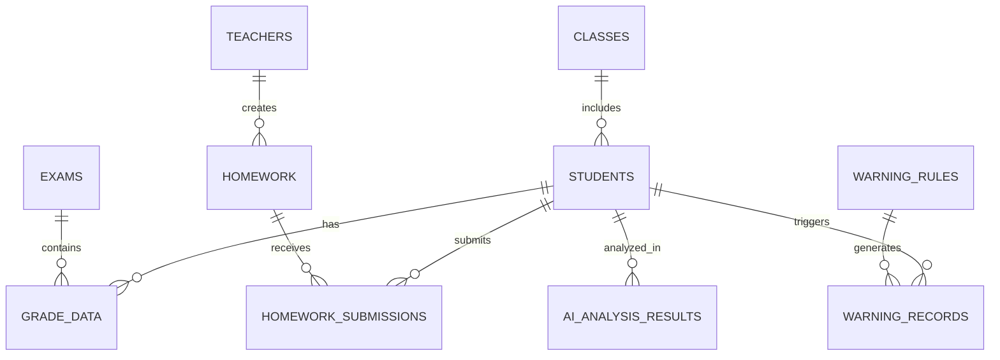

# 🗄️ 数据库架构完整文档

> **多Agent协作核心** - 数据库设计和架构的统一参考

## 🎯 使用指南

### 📌 重要约定
1. **所有Agent必须严格遵循此架构**
2. **数据库变更必须通过migration**
3. **表结构修改必须更新此文档**
4. **新增表必须添加到相应模块**

---

## 🏗️ 数据库架构总览

### 📊 数据库统计
- **总表数**: 50个
- **核心业务表**: 12个
- **配置管理表**: 15个  
- **分析增强表**: 12个
- **系统管理表**: 11个

### 🔗 主要关联关系



---

## 📋 核心业务表详解

### 🎓 1. students - 学生信息表

```sql
CREATE TABLE students (
  id UUID PRIMARY KEY DEFAULT gen_random_uuid(),
  name TEXT NOT NULL,
  student_number TEXT UNIQUE,
  class_id UUID REFERENCES classes(id),
  grade TEXT,
  gender TEXT,
  birth_date DATE,
  enrollment_date DATE,
  status TEXT DEFAULT 'active',
  contact_info JSONB,
  created_at TIMESTAMP WITH TIME ZONE DEFAULT NOW(),
  updated_at TIMESTAMP WITH TIME ZONE DEFAULT NOW()
);
```

**字段说明**:
- `id`: 学生唯一标识
- `student_number`: 学号，全局唯一
- `class_id`: 关联班级ID
- `contact_info`: JSON格式存储联系方式

**索引**:
- `PRIMARY KEY (id)`
- `UNIQUE (student_number)`
- `INDEX (class_id)`

**关联表**: grade_data, homework_submissions, warning_records

---

### 📊 2. exams - 考试信息表

```sql
CREATE TABLE exams (
  id UUID PRIMARY KEY DEFAULT gen_random_uuid(),
  title TEXT NOT NULL,
  type TEXT NOT NULL, -- '月考', '期中', '期末', '单元测试'
  date DATE NOT NULL,
  subject TEXT,
  scope TEXT, -- '班级', '年级', '学校'
  total_score NUMERIC,
  pass_score NUMERIC,
  created_by UUID REFERENCES teachers(id),
  created_at TIMESTAMP WITH TIME ZONE DEFAULT NOW(),
  updated_at TIMESTAMP WITH TIME ZONE DEFAULT NOW()
);
```

**字段说明**:
- `type`: 考试类型，标准化取值
- `scope`: 考试范围，影响排名计算
- `total_score`: 总分，用于成绩计算

**索引**:
- `PRIMARY KEY (id)`
- `INDEX (date)`
- `INDEX (type)`
- `INDEX (created_by)`

**关联表**: grade_data

---

### 📈 3. grade_data - 成绩数据表 ⭐️ 核心表

```sql
CREATE TABLE grade_data (
  id UUID PRIMARY KEY DEFAULT gen_random_uuid(),
  exam_id UUID NOT NULL REFERENCES exams(id) ON DELETE CASCADE,
  student_id TEXT NOT NULL, -- 可以是UUID或学号
  name TEXT NOT NULL, -- 学生姓名
  class_name TEXT,
  subject TEXT, -- 科目名称，NULL表示总分
  score NUMERIC, -- 分数
  grade TEXT, -- 等级 A/B/C/D 或 优/良/中/差
  rank_in_class INTEGER, -- 班级排名
  rank_in_grade INTEGER, -- 年级排名  
  rank_in_school INTEGER, -- 学校排名
  grade_level TEXT, -- 年级
  percentile NUMERIC, -- 百分位数
  created_at TIMESTAMP WITH TIME ZONE DEFAULT NOW(),
  updated_at TIMESTAMP WITH TIME ZONE DEFAULT NOW(),
  
  -- 支持多科目的唯一约束
  CONSTRAINT unique_exam_student_subject UNIQUE(exam_id, student_id, subject)
);
```

**重要特性**:
- ✅ **支持多科目存储**: 同一学生同一考试可存储多个科目成绩
- ✅ **总分记录**: subject为NULL或'总分'的记录
- ✅ **灵活学生ID**: 支持UUID或学号格式
- ✅ **完整排名**: 支持班级、年级、学校三级排名

**索引**:
- `PRIMARY KEY (id)`
- `UNIQUE (exam_id, student_id, subject)`
- `INDEX (exam_id, student_id, subject)`
- `INDEX (subject)` WHERE subject IS NOT NULL
- `INDEX (grade)` WHERE grade IS NOT NULL

**数据示例**:
```sql
-- 学生总分记录
INSERT INTO grade_data (exam_id, student_id, name, subject, score, grade) 
VALUES ('exam-uuid', 'stu-001', '张三', '总分', 540, 'A');

-- 学生单科记录
INSERT INTO grade_data (exam_id, student_id, name, subject, score, grade) 
VALUES ('exam-uuid', 'stu-001', '张三', '数学', 90, 'A');
```

---

### 🏫 4. classes - 班级信息表

```sql
CREATE TABLE classes (
  id UUID PRIMARY KEY DEFAULT gen_random_uuid(),
  name TEXT NOT NULL, -- 班级名称，如"三年级1班"
  grade TEXT NOT NULL, -- 年级，如"三年级"
  class_teacher_id UUID REFERENCES teachers(id),
  academic_year TEXT, -- 学年，如"2024-2025"
  student_count INTEGER DEFAULT 0,
  description TEXT,
  created_by UUID REFERENCES teachers(id),
  created_at TIMESTAMP WITH TIME ZONE DEFAULT NOW(),
  updated_at TIMESTAMP WITH TIME ZONE DEFAULT NOW()
);
```

**字段说明**:
- `name`: 班级完整名称，用于成绩数据关联
- `grade`: 年级标识，用于排名计算
- `student_count`: 班级人数，自动维护

**索引**:
- `PRIMARY KEY (id)`
- `INDEX (grade)`
- `INDEX (class_teacher_id)`

---

### 👨‍🏫 5. teachers - 教师信息表

```sql
CREATE TABLE teachers (
  id UUID PRIMARY KEY DEFAULT gen_random_uuid(),
  name TEXT NOT NULL,
  employee_number TEXT UNIQUE,
  subjects TEXT[], -- 任教科目数组
  classes_taught UUID[], -- 任教班级UUID数组
  contact_info JSONB,
  department TEXT,
  position TEXT, -- 职位：班主任、科任老师、年级主任等
  user_id UUID REFERENCES auth.users(id),
  created_at TIMESTAMP WITH TIME ZONE DEFAULT NOW(),
  updated_at TIMESTAMP WITH TIME ZONE DEFAULT NOW()
);
```

**字段说明**:
- `subjects`: PostgreSQL数组类型，存储多个科目
- `classes_taught`: 任教班级的UUID数组
- `user_id`: 关联认证用户

---

### 📝 6. homework - 作业信息表

```sql
CREATE TABLE homework (
  id UUID PRIMARY KEY DEFAULT gen_random_uuid(),
  title TEXT NOT NULL,
  description TEXT,
  subject TEXT NOT NULL,
  class_id UUID REFERENCES classes(id),
  teacher_id UUID NOT NULL REFERENCES teachers(id),
  knowledge_points TEXT[], -- 涉及知识点
  difficulty_level INTEGER DEFAULT 1, -- 1-5难度等级
  total_score NUMERIC DEFAULT 100,
  due_date TIMESTAMP WITH TIME ZONE,
  auto_grading BOOLEAN DEFAULT false,
  grading_criteria JSONB, -- 评分标准
  attachment_urls TEXT[],
  status TEXT DEFAULT 'active', -- active, closed, draft
  created_at TIMESTAMP WITH TIME ZONE DEFAULT NOW(),
  updated_at TIMESTAMP WITH TIME ZONE DEFAULT NOW()
);
```

**字段说明**:
- `knowledge_points`: 关联的知识点数组
- `grading_criteria`: JSON格式的评分标准
- `auto_grading`: 是否支持自动评分

---

### 📋 7. homework_submissions - 作业提交表

```sql
CREATE TABLE homework_submissions (
  id UUID PRIMARY KEY DEFAULT gen_random_uuid(),
  homework_id UUID NOT NULL REFERENCES homework(id) ON DELETE CASCADE,
  student_id UUID NOT NULL REFERENCES students(id),
  content TEXT, -- 作业内容
  attachment_urls TEXT[], -- 附件URL数组
  submission_time TIMESTAMP WITH TIME ZONE DEFAULT NOW(),
  score NUMERIC, -- 得分
  grade TEXT, -- 等级
  teacher_feedback TEXT, -- 教师反馈
  ai_feedback JSONB, -- AI反馈，JSON格式
  knowledge_mastery JSONB, -- 知识点掌握情况
  graded_by UUID REFERENCES teachers(id),
  graded_at TIMESTAMP WITH TIME ZONE,
  status TEXT DEFAULT 'submitted', -- submitted, graded, returned
  is_late BOOLEAN DEFAULT false,
  
  CONSTRAINT unique_homework_student UNIQUE(homework_id, student_id)
);
```

**重要特性**:
- ✅ **防重复提交**: homework_id + student_id 唯一约束
- ✅ **AI辅助**: 支持AI反馈和知识点分析
- ✅ **延迟标记**: 自动判断是否迟交

---

### 🧠 8. knowledge_points - 知识点表

```sql
CREATE TABLE knowledge_points (
  id UUID PRIMARY KEY DEFAULT gen_random_uuid(),
  name TEXT NOT NULL,
  description TEXT,
  subject TEXT NOT NULL,
  grade_level TEXT,
  difficulty_level INTEGER DEFAULT 1, -- 1-5难度等级
  parent_id UUID REFERENCES knowledge_points(id), -- 支持层级结构
  learning_objectives TEXT[],
  prerequisites UUID[], -- 前置知识点
  related_points UUID[], -- 相关知识点
  created_by UUID REFERENCES teachers(id),
  created_at TIMESTAMP WITH TIME ZONE DEFAULT NOW(),
  updated_at TIMESTAMP WITH TIME ZONE DEFAULT NOW()
);
```

**层级结构**:
- 支持父子关系，构建知识点树
- 支持前置依赖和关联关系

---

### ⚠️ 9. warning_records - 预警记录表

```sql
CREATE TABLE warning_records (
  id UUID PRIMARY KEY DEFAULT gen_random_uuid(),
  student_id UUID NOT NULL REFERENCES students(id),
  warning_type TEXT NOT NULL, -- 预警类型
  severity TEXT NOT NULL, -- low, medium, high, critical
  title TEXT NOT NULL,
  description TEXT,
  trigger_data JSONB, -- 触发预警的数据
  rule_id UUID REFERENCES warning_rules(id),
  status TEXT DEFAULT 'active', -- active, resolved, dismissed
  resolved_by UUID REFERENCES teachers(id),
  resolved_at TIMESTAMP WITH TIME ZONE,
  resolution_notes TEXT,
  created_at TIMESTAMP WITH TIME ZONE DEFAULT NOW(),
  updated_at TIMESTAMP WITH TIME ZONE DEFAULT NOW()
);
```

**预警类型**:
- `grade_drop`: 成绩下降
- `attendance`: 出勤问题
- `behavior`: 行为问题
- `homework_completion`: 作业完成率低

---

### 📋 10. warning_rules - 预警规则表

```sql
CREATE TABLE warning_rules (
  id UUID PRIMARY KEY DEFAULT gen_random_uuid(),
  name TEXT NOT NULL,
  description TEXT,
  rule_type TEXT NOT NULL, -- grade_based, attendance_based, etc.
  conditions JSONB NOT NULL, -- 规则条件，JSON格式
  actions JSONB, -- 预警触发后的动作
  severity TEXT NOT NULL, -- 预警严重级别
  enabled BOOLEAN DEFAULT true,
  trigger_frequency TEXT DEFAULT 'immediate', -- 触发频率
  created_by UUID REFERENCES teachers(id),
  created_at TIMESTAMP WITH TIME ZONE DEFAULT NOW(),
  updated_at TIMESTAMP WITH TIME ZONE DEFAULT NOW()
);
```

**规则示例**:
```json
{
  "conditions": {
    "grade_drop": {
      "threshold": 10,
      "timeframe": "30_days"
    }
  },
  "actions": {
    "notify_teacher": true,
    "create_intervention": true
  }
}
```

---

### 🤖 11. ai_analysis_results - AI分析结果表

```sql
CREATE TABLE ai_analysis_results (
  id UUID PRIMARY KEY DEFAULT gen_random_uuid(),
  user_id UUID REFERENCES auth.users(id),
  data_hash VARCHAR(32) NOT NULL, -- 数据指纹，用于缓存
  exam_id UUID, -- 关联考试ID（可选）
  analysis_type VARCHAR(50) NOT NULL, -- 分析类型
  analysis_data JSONB NOT NULL, -- AI分析结果
  grade_data_summary JSONB, -- 成绩数据摘要
  created_at TIMESTAMP WITH TIME ZONE DEFAULT NOW(),
  updated_at TIMESTAMP WITH TIME ZONE DEFAULT NOW(),
  expires_at TIMESTAMP WITH TIME ZONE DEFAULT (NOW() + INTERVAL '7 days')
);
```

**分析类型**:
- `class_diagnosis`: 班级诊断
- `student_guidance`: 学生指导
- `subject_analysis`: 科目分析
- `learning_pattern`: 学习模式分析

**缓存机制**:
- 基于data_hash实现智能缓存
- 默认7天过期，自动清理

**RLS安全策略**:
```sql
-- 用户只能访问自己的分析结果
CREATE POLICY "Users can view their own AI analysis" ON ai_analysis_results
  FOR SELECT USING (auth.uid() = user_id);
```

---

### 📚 12. subjects - 科目表

```sql
CREATE TABLE subjects (
  subject_code TEXT PRIMARY KEY, -- 科目代码，如'MATH', 'CHINESE'
  subject_name TEXT NOT NULL, -- 科目名称，如'数学', '语文'
  subject_name_en TEXT, -- 英文名称
  category TEXT, -- 科目分类：主科、副科、选修
  total_score NUMERIC DEFAULT 100, -- 标准总分
  pass_score NUMERIC DEFAULT 60, -- 及格分数
  grade_levels TEXT[], -- 适用年级
  description TEXT,
  created_at TIMESTAMP WITH TIME ZONE DEFAULT NOW(),
  updated_at TIMESTAMP WITH TIME ZONE DEFAULT NOW()
);
```

**标准科目代码**:
- `CHINESE`: 语文
- `MATH`: 数学  
- `ENGLISH`: 英语
- `PHYSICS`: 物理
- `CHEMISTRY`: 化学
- `BIOLOGY`: 生物
- `HISTORY`: 历史
- `GEOGRAPHY`: 地理
- `POLITICS`: 政治

---

## ⚙️ 配置管理表

### 🔧 系统配置类

#### user_profiles - 用户配置表
```sql
CREATE TABLE user_profiles (
  id UUID PRIMARY KEY DEFAULT gen_random_uuid(),
  user_id UUID UNIQUE REFERENCES auth.users(id),
  display_name TEXT,
  avatar_url TEXT,
  role TEXT NOT NULL, -- teacher, student, admin
  school_id UUID,
  preferences JSONB DEFAULT '{}',
  created_at TIMESTAMP WITH TIME ZONE DEFAULT NOW(),
  updated_at TIMESTAMP WITH TIME ZONE DEFAULT NOW()
);
```

#### user_settings - 用户设置表
```sql
CREATE TABLE user_settings (
  id UUID PRIMARY KEY DEFAULT gen_random_uuid(),
  user_id UUID UNIQUE REFERENCES auth.users(id),
  language TEXT DEFAULT 'zh-CN',
  timezone TEXT DEFAULT 'Asia/Shanghai',
  theme TEXT DEFAULT 'light',
  notification_preferences JSONB DEFAULT '{}',
  ui_preferences JSONB DEFAULT '{}',
  created_at TIMESTAMP WITH TIME ZONE DEFAULT NOW(),
  updated_at TIMESTAMP WITH TIME ZONE DEFAULT NOW()
);
```

#### user_ai_configs - 用户AI配置表
```sql
CREATE TABLE user_ai_configs (
  id UUID PRIMARY KEY DEFAULT gen_random_uuid(),
  user_id UUID UNIQUE REFERENCES auth.users(id),
  default_provider TEXT DEFAULT 'openai',
  provider_configs JSONB DEFAULT '{}', -- 各提供商配置
  model_preferences JSONB DEFAULT '{}',
  created_at TIMESTAMP WITH TIME ZONE DEFAULT NOW(),
  updated_at TIMESTAMP WITH TIME ZONE DEFAULT NOW()
);
```

### 📊 评分配置类

#### grading_scales - 评分量表表
```sql
CREATE TABLE grading_scales (
  id UUID PRIMARY KEY DEFAULT gen_random_uuid(),
  name TEXT NOT NULL,
  description TEXT,
  scale_type TEXT NOT NULL, -- letter, numeric, percentage
  is_default BOOLEAN DEFAULT false,
  school_id UUID,
  created_by UUID REFERENCES teachers(id),
  created_at TIMESTAMP WITH TIME ZONE DEFAULT NOW()
);
```

#### grading_scale_levels - 评分等级表
```sql
CREATE TABLE grading_scale_levels (
  id UUID PRIMARY KEY DEFAULT gen_random_uuid(),
  scale_id UUID NOT NULL REFERENCES grading_scales(id),
  level_name TEXT NOT NULL, -- A, B, C, D 或 优, 良, 中, 差
  min_score NUMERIC NOT NULL,
  max_score NUMERIC NOT NULL,
  description TEXT,
  color TEXT, -- 显示颜色
  sort_order INTEGER
);
```

---

## 📈 分析增强表

### 🎯 学生画像类

#### student_portraits - 学生画像表
```sql
CREATE TABLE student_portraits (
  id UUID PRIMARY KEY DEFAULT gen_random_uuid(),
  student_id UUID NOT NULL REFERENCES students(id),
  academic_performance JSONB, -- 学业表现数据
  learning_style JSONB, -- 学习风格
  behavior_patterns JSONB, -- 行为模式
  strength_areas TEXT[], -- 优势领域
  improvement_areas TEXT[], -- 改进领域
  ai_insights JSONB, -- AI洞察
  confidence_score NUMERIC, -- 画像置信度
  last_updated TIMESTAMP WITH TIME ZONE DEFAULT NOW(),
  created_at TIMESTAMP WITH TIME ZONE DEFAULT NOW()
);
```

#### student_learning_behaviors - 学习行为表
```sql
CREATE TABLE student_learning_behaviors (
  id UUID PRIMARY KEY DEFAULT gen_random_uuid(),
  student_id UUID NOT NULL REFERENCES students(id),
  behavior_type TEXT NOT NULL, -- study_time, participation, etc.
  behavior_data JSONB NOT NULL,
  recorded_at TIMESTAMP WITH TIME ZONE DEFAULT NOW(),
  source TEXT, -- homework, exam, class_activity
  created_at TIMESTAMP WITH TIME ZONE DEFAULT NOW()
);
```

### 🏷️ 标签系统类

#### student_ai_tags - AI标签表
```sql
CREATE TABLE student_ai_tags (
  id UUID PRIMARY KEY DEFAULT gen_random_uuid(),
  student_id UUID NOT NULL REFERENCES students(id),
  tag_type TEXT NOT NULL, -- learning_style, personality, ability
  tag_name TEXT NOT NULL,
  confidence NUMERIC NOT NULL, -- 0-1 置信度
  evidence JSONB, -- 支持证据
  created_by_ai TEXT, -- AI模型标识
  created_at TIMESTAMP WITH TIME ZONE DEFAULT NOW(),
  
  CONSTRAINT unique_student_ai_tag UNIQUE(student_id, tag_type, tag_name)
);
```

#### student_custom_tags - 自定义标签表
```sql
CREATE TABLE student_custom_tags (
  id UUID PRIMARY KEY DEFAULT gen_random_uuid(),
  student_id UUID NOT NULL REFERENCES students(id),
  tag_name TEXT NOT NULL,
  tag_color TEXT DEFAULT '#blue',
  description TEXT,
  created_by UUID REFERENCES teachers(id),
  created_at TIMESTAMP WITH TIME ZONE DEFAULT NOW(),
  
  CONSTRAINT unique_student_custom_tag UNIQUE(student_id, tag_name)
);
```

---

## 🔧 系统管理表

### 📊 监控和缓存类

#### system_monitoring - 系统监控表
```sql
CREATE TABLE system_monitoring (
  id UUID PRIMARY KEY DEFAULT gen_random_uuid(),
  metric_name TEXT NOT NULL,
  metric_value NUMERIC,
  metric_data JSONB,
  recorded_at TIMESTAMP WITH TIME ZONE DEFAULT NOW(),
  created_at TIMESTAMP WITH TIME ZONE DEFAULT NOW()
);
```

#### cache_control - 缓存控制表
```sql
CREATE TABLE cache_control (
  cache_key TEXT PRIMARY KEY,
  cache_data JSONB,
  expires_at TIMESTAMP WITH TIME ZONE,
  created_at TIMESTAMP WITH TIME ZONE DEFAULT NOW(),
  updated_at TIMESTAMP WITH TIME ZONE DEFAULT NOW()
);
```

#### analysis_results_cache - 分析结果缓存表
```sql
CREATE TABLE analysis_results_cache (
  id UUID PRIMARY KEY DEFAULT gen_random_uuid(),
  cache_key TEXT UNIQUE NOT NULL,
  result_data JSONB NOT NULL,
  expires_at TIMESTAMP WITH TIME ZONE,
  hit_count INTEGER DEFAULT 0,
  created_at TIMESTAMP WITH TIME ZONE DEFAULT NOW(),
  last_accessed TIMESTAMP WITH TIME ZONE DEFAULT NOW()
);
```

---

## 🔗 表关系图

### 📊 核心关系
```
students (1) ----< (N) grade_data
exams (1) -------< (N) grade_data
classes (1) -----< (N) students
teachers (1) ----< (N) homework
students (1) ----< (N) homework_submissions
homework (1) ----< (N) homework_submissions
```

### ⚠️ 预警关系
```
students (1) ----< (N) warning_records
warning_rules (1) < (N) warning_records
```

### 🤖 AI分析关系
```
auth.users (1) --< (N) ai_analysis_results
exams (1) -------< (N) ai_analysis_results (optional)
```

### 🎯 画像关系
```
students (1) ----< (1) student_portraits
students (1) ----< (N) student_learning_behaviors
students (1) ----< (N) student_ai_tags
students (1) ----< (N) student_custom_tags
```

---

## 🔒 安全策略

### 🛡️ Row Level Security (RLS)

#### 已启用RLS的表
- `ai_analysis_results`: 用户只能访问自己的分析结果

#### RLS策略示例
```sql
-- AI分析结果表的RLS策略
ALTER TABLE ai_analysis_results ENABLE ROW LEVEL SECURITY;

CREATE POLICY "Users can view their own AI analysis" ON ai_analysis_results
  FOR SELECT USING (auth.uid() = user_id);

CREATE POLICY "Users can insert their own AI analysis" ON ai_analysis_results
  FOR INSERT WITH CHECK (auth.uid() = user_id);

CREATE POLICY "Users can update their own AI analysis" ON ai_analysis_results
  FOR UPDATE USING (auth.uid() = user_id);
```

### 🔑 权限管理

#### 角色定义
- `admin`: 系统管理员，全部权限
- `teacher`: 教师，管理自己班级和学生
- `student`: 学生，查看自己的数据

---

## 📊 索引策略

### 🚀 性能优化索引

#### 核心查询索引
```sql
-- 成绩数据核心索引
CREATE INDEX idx_grade_data_exam_student_subject 
ON grade_data(exam_id, student_id, subject);

CREATE INDEX idx_grade_data_subject 
ON grade_data(subject) WHERE subject IS NOT NULL;

CREATE INDEX idx_grade_data_grade 
ON grade_data(grade) WHERE grade IS NOT NULL;

-- 时间范围查询索引
CREATE INDEX idx_exams_date ON exams(date);
CREATE INDEX idx_homework_submissions_time ON homework_submissions(submission_time);

-- AI分析缓存索引
CREATE INDEX idx_ai_analysis_user_hash ON ai_analysis_results(user_id, data_hash);
CREATE INDEX idx_ai_analysis_expires ON ai_analysis_results(expires_at);
```

#### 文本搜索索引
```sql
-- 学生姓名搜索
CREATE INDEX idx_students_name_gin ON students USING GIN(to_tsvector('chinese', name));

-- 考试标题搜索
CREATE INDEX idx_exams_title_gin ON exams USING GIN(to_tsvector('chinese', title));
```

---

## 🔄 数据库函数

### 📈 成绩分析函数

#### 1. get_student_subject_scores()
```sql
CREATE OR REPLACE FUNCTION get_student_subject_scores(p_exam_id UUID, p_student_id TEXT)
RETURNS TABLE (
    subject TEXT,
    score NUMERIC,
    grade TEXT,
    rank_in_class INTEGER,
    rank_in_grade INTEGER,
    rank_in_school INTEGER
) AS $$
BEGIN
    RETURN QUERY
    SELECT 
        gd.subject,
        gd.score,
        gd.grade,
        gd.rank_in_class,
        gd.rank_in_grade,
        gd.rank_in_school
    FROM grade_data gd
    WHERE gd.exam_id = p_exam_id 
    AND gd.student_id = p_student_id
    ORDER BY 
        CASE gd.subject 
            WHEN '总分' THEN 1 
            ELSE 2 
        END,
        gd.subject;
END;
$$ LANGUAGE plpgsql;
```

#### 2. get_subject_analysis()
```sql
CREATE OR REPLACE FUNCTION get_subject_analysis(p_exam_id UUID)
RETURNS TABLE (
    subject TEXT,
    student_count INTEGER,
    avg_score NUMERIC,
    max_score NUMERIC,
    min_score NUMERIC,
    std_dev NUMERIC,
    pass_rate NUMERIC
) AS $$
BEGIN
    RETURN QUERY
    SELECT 
        gd.subject,
        COUNT(*)::INTEGER AS student_count,
        AVG(gd.score)::NUMERIC AS avg_score,
        MAX(gd.score)::NUMERIC AS max_score,
        MIN(gd.score)::NUMERIC AS min_score,
        STDDEV(gd.score)::NUMERIC AS std_dev,
        (COUNT(CASE WHEN gd.score >= 60 THEN 1 END)::NUMERIC / 
         NULLIF(COUNT(*)::NUMERIC, 0) * 100)::NUMERIC AS pass_rate
    FROM grade_data gd
    WHERE gd.exam_id = p_exam_id 
    AND gd.subject IS NOT NULL
    AND gd.score IS NOT NULL
    GROUP BY gd.subject
    ORDER BY 
        CASE gd.subject 
            WHEN '总分' THEN 1 
            ELSE 2 
        END,
        gd.subject;
END;
$$ LANGUAGE plpgsql;
```

#### 3. get_grade_distribution()
```sql
CREATE OR REPLACE FUNCTION get_grade_distribution(p_exam_id UUID, p_subject TEXT DEFAULT NULL)
RETURNS TABLE (
    grade TEXT,
    count INTEGER,
    percentage NUMERIC
) AS $$
BEGIN
    RETURN QUERY
    WITH grade_counts AS (
        SELECT 
            gd.grade,
            COUNT(*) AS count
        FROM grade_data gd
        WHERE gd.exam_id = p_exam_id
        AND (p_subject IS NULL OR gd.subject = p_subject)
        AND gd.grade IS NOT NULL
        GROUP BY gd.grade
    ),
    total AS (
        SELECT COUNT(*) AS total_count 
        FROM grade_data gd
        WHERE gd.exam_id = p_exam_id
        AND (p_subject IS NULL OR gd.subject = p_subject)
        AND gd.grade IS NOT NULL
    )
    SELECT 
        gc.grade,
        gc.count::INTEGER,
        (gc.count::NUMERIC / NULLIF(t.total_count, 0) * 100)::NUMERIC AS percentage
    FROM grade_counts gc, total t
    ORDER BY gc.grade;
END;
$$ LANGUAGE plpgsql;
```

#### 4. check_grade_data_integrity()
```sql
CREATE OR REPLACE FUNCTION check_grade_data_integrity()
RETURNS TABLE (
    check_name TEXT,
    status TEXT,
    description TEXT,
    count INTEGER
) AS $$
BEGIN
    -- 检查1: 缺少总分的学生
    RETURN QUERY
    SELECT 
        '缺少总分记录'::TEXT,
        CASE WHEN COUNT(*) > 0 THEN 'WARNING' ELSE 'OK' END::TEXT,
        '有学生缺少总分记录'::TEXT,
        COUNT(*)::INTEGER
    FROM (
        SELECT DISTINCT gd1.exam_id, gd1.student_id
        FROM grade_data gd1
        WHERE NOT EXISTS (
            SELECT 1 FROM grade_data gd2 
            WHERE gd2.exam_id = gd1.exam_id 
            AND gd2.student_id = gd1.student_id 
            AND gd2.subject = '总分'
        )
    ) missing_totals;
    
    -- 检查2: 孤立的科目成绩
    RETURN QUERY
    SELECT 
        '孤立科目成绩'::TEXT,
        CASE WHEN COUNT(*) > 0 THEN 'INFO' ELSE 'OK' END::TEXT,
        '有科目成绩但无总分记录'::TEXT,
        COUNT(*)::INTEGER
    FROM grade_data gd1
    WHERE gd1.subject != '总分' 
    AND gd1.subject IS NOT NULL
    AND NOT EXISTS (
        SELECT 1 FROM grade_data gd2 
        WHERE gd2.exam_id = gd1.exam_id 
        AND gd2.student_id = gd1.student_id 
        AND gd2.subject = '总分'
    );
    
    -- 检查3: 空的科目字段
    RETURN QUERY
    SELECT 
        '空科目字段'::TEXT,
        CASE WHEN COUNT(*) > 0 THEN 'WARNING' ELSE 'OK' END::TEXT,
        '有记录的科目字段为空'::TEXT,
        COUNT(*)::INTEGER
    FROM grade_data
    WHERE subject IS NULL OR subject = '';
END;
$$ LANGUAGE plpgsql;
```

### 🧹 清理函数

#### cleanup_expired_ai_analysis()
```sql
CREATE OR REPLACE FUNCTION cleanup_expired_ai_analysis()
RETURNS void AS $$
BEGIN
  DELETE FROM ai_analysis_results WHERE expires_at < NOW();
  RAISE NOTICE '已清理过期的AI分析记录';
END;
$$ LANGUAGE plpgsql;
```

---

## 📚 数据约定

### 🏷️ 标准化取值

#### 考试类型 (exams.type)
- `月考`: 月度考试
- `期中`: 期中考试
- `期末`: 期末考试
- `单元测试`: 单元测试
- `模拟考试`: 模拟考试

#### 成绩等级 (grade_data.grade)
- **字母等级**: A、B、C、D、F
- **中文等级**: 优、良、中、差、不及格
- **百分制等级**: 90-100、80-89、70-79、60-69、0-59

#### 预警严重级别 (warning_records.severity)
- `low`: 轻微
- `medium`: 中等
- `high`: 严重
- `critical`: 危急

#### 用户角色 (user_profiles.role)
- `admin`: 系统管理员
- `teacher`: 教师
- `student`: 学生
- `parent`: 家长

### 📊 数据格式约定

#### JSON字段格式

**contact_info** (联系信息):
```json
{
  "phone": "13800138000",
  "email": "student@example.com",
  "address": "北京市朝阳区...",
  "emergency_contact": {
    "name": "张父",
    "phone": "13800138001",
    "relationship": "父亲"
  }
}
```

**analysis_data** (AI分析结果):
```json
{
  "overall_performance": "良好",
  "strengths": ["数学", "物理"],
  "weaknesses": ["语文", "英语"],
  "recommendations": [
    {
      "type": "study_method",
      "content": "建议加强语文阅读练习"
    }
  ],
  "confidence": 0.85
}
```

**grading_criteria** (评分标准):
```json
{
  "total_score": 100,
  "criteria": [
    {
      "name": "内容完整性",
      "weight": 0.4,
      "max_score": 40
    },
    {
      "name": "准确性",
      "weight": 0.3,
      "max_score": 30
    }
  ]
}
```

---

## 🚨 重要注意事项

### ⚡ 性能注意事项
1. **grade_data表是核心表，查询时必须使用合适的索引**
2. **大批量数据插入时使用BATCH操作**
3. **复杂分析查询优先使用数据库函数**
4. **AI分析结果必须设置合理的过期时间**

### 🔒 安全注意事项
1. **所有用户相关数据必须通过RLS保护**
2. **敏感数据（如联系方式）需要加密存储**
3. **API密钥等配置信息必须加密**
4. **数据访问必须经过权限验证**

### 🔄 数据一致性
1. **使用外键约束保证引用完整性**
2. **关键业务逻辑使用数据库事务**
3. **定期运行数据完整性检查函数**
4. **重要操作记录操作日志**

### 📈 扩展性考虑
1. **预留扩展字段（JSONB类型）**
2. **使用UUID作为主键支持分布式**
3. **设计支持多租户的数据隔离**
4. **考虑历史数据归档策略**

---

**📌 重要提醒**: 
- 此文档是数据库操作的权威参考
- 任何表结构变更都必须通过migration
- 新增表或字段必须立即更新此文档
- 数据库操作必须遵循此文档的约定

**🔄 文档版本**: v1.0 | **最后更新**: 2025-01-04