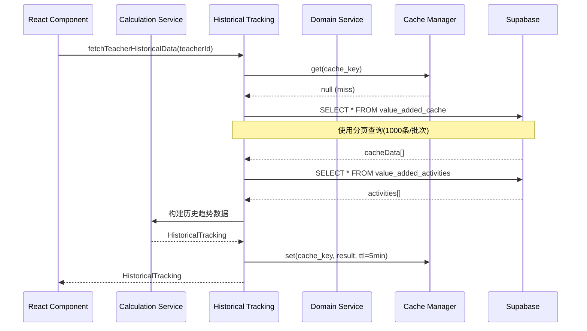

# 增值评价系统 - 接口架构和数据流审查报告

**版本**: v1.0
**创建日期**: 2026-02-13
**审查人**: API Architecture Reviewer
**审查范围**: 增值评价系统前后端接口、数据流、RLS策略、缓存和性能优化

---

## 📋 执行摘要

### 综合评分: 78/100 (良好)

| 维度 | 评分 | 等级 |
|------|------|------|
| 架构设计 | 85/100 | 优秀 |
| 数据流合理性 | 80/100 | 良好 |
| 安全性(RLS) | 70/100 | 中等 |
| 性能优化 | 75/100 | 良好 |
| 错误处理 | 80/100 | 良好 |
| 学校隔离 | 65/100 | 中等 |

### 核心发现

✅ **优点**:
1. 采用清晰的分层架构设计
2. 计算服务与数据服务解耦
3. 实现了完整的缓存策略(内存+数据库)
4. 分页查询突破Supabase 1000条限制
5. 统一的错误处理机制

⚠️ **关键问题**:
1. **P0**: 增值评价计算服务缺少学校隔离逻辑
2. **P1**: RLS策略过于宽松(`FOR SELECT USING (true)`)
3. **P1**: 缺少API请求重试机制
4. **P2**: 缓存失效策略不够精细
5. **P2**: 缺少数据库查询性能监控

---

## 🏗️ 系统架构概览

### 整体架构模式

系统采用**三层架构 + 领域驱动设计(DDD)**:

```
┌─────────────────────────────────────────────────────────┐
│                   Presentation Layer                    │
│               (React Components + Hooks)                │
└─────────────────────┬───────────────────────────────────┘
                      │
┌─────────────────────▼───────────────────────────────────┐
│                  Business Logic Layer                   │
│                                                          │
│  ┌─────────────────────────────────────────────────┐   │
│  │  Calculation Services (Pure Functions)          │   │
│  │  - teacherValueAddedService.ts                  │   │
│  │  - classValueAddedService.ts                    │   │
│  │  - studentValueAddedService.ts                  │   │
│  └─────────────────────────────────────────────────┘   │
│                                                          │
│  ┌─────────────────────────────────────────────────┐   │
│  │  Domain Services (Data Access)                   │   │
│  │  - domains/GradeDataService.ts                  │   │
│  │  - domains/StudentDataService.ts                │   │
│  │  - domains/ExamDataService.ts                   │   │
│  └─────────────────────────────────────────────────┘   │
│                                                          │
│  ┌─────────────────────────────────────────────────┐   │
│  │  Query Services (Historical & Analytics)        │   │
│  │  - historicalTrackingService.ts                 │   │
│  │  - ai/advancedAnalysisEngine.ts                 │   │
│  └─────────────────────────────────────────────────┘   │
└─────────────────────┬───────────────────────────────────┘
                      │
┌─────────────────────▼───────────────────────────────────┐
│                Infrastructure Layer                      │
│                                                          │
│  ┌──────────────┐  ┌──────────────┐  ┌──────────────┐  │
│  │ APIClient    │  │ CacheManager │  │ ErrorHandler │  │
│  │ (core/api)   │  │ (core/cache) │  │ (errorHandler)│ │
│  └──────────────┘  └──────────────┘  └──────────────┘  │
│                                                          │
│  ┌──────────────┐  ┌──────────────┐                     │
│  │DatabaseManager│  │ Logger       │                     │
│  │(core/database)│  │ (utils/)     │                     │
│  └──────────────┘  └──────────────┘                     │
└─────────────────────┬───────────────────────────────────┘
                      │
┌─────────────────────▼───────────────────────────────────┐
│                    Data Layer                            │
│            Supabase Client + RLS Policies                │
└──────────────────────────────────────────────────────────┘
```

### 设计优势

1. **职责分离**: 计算服务(算法)与数据服务(CRUD)完全解耦
2. **可测试性**: 计算服务是纯函数,易于单元测试
3. **可扩展性**: 新增维度只需添加新的计算服务
4. **复用性**: 统一的基础设施服务可跨模块使用

---

## 📊 数据流分析

### 1. 增值评价计算流程



**分析**:
- ✅ 使用内存缓存减少数据库查询
- ✅ 分页查询避免1000条限制
- ✅ 数据聚合在应用层完成,减少数据库负载
- ⚠️ 缓存键生成逻辑未考虑学校隔离

### 2. Excel导入到数据库流程

```
[Excel文件]
    ↓ (excelImportService.ts)
[解析为JSON]
    ↓ (数据验证)
[学生信息] → students表
[教学编排] → teacher_student_subjects表
[成绩数据] → grade_data表
    ↓ (触发)
[增值计算] → value_added_activities表
    ↓ (缓存)
[计算结果] → value_added_cache表
```

**关键点**:
- 文件位置: `src/services/excelImportService.ts:1-200`
- 支持4种Excel格式: 学生信息、教学编排、走班信息、成绩数据
- 支持等级列解析(如"语文等级" → chinese_grade)
- 处理缺考(Q)、未参加(N)等特殊标记

**问题**:
- ⚠️ 导入过程未验证school_id
- ⚠️ 批量插入未使用事务保护

### 3. 缓存策略设计

#### 内存缓存 (CacheManager)

```typescript
// 文件: src/services/core/cache.ts
export const requestCache = new CacheManager({
  defaultTTL: 10 * 60 * 1000, // 10分钟
  maxSize: 500,
});

export const dataCache = new CacheManager({
  defaultTTL: 5 * 60 * 1000, // 5分钟
  maxSize: 1000,
});
```

**特性**:
- ✅ 支持LRU淘汰策略
- ✅ 自动清理过期项(1分钟间隔)
- ✅ 提供缓存统计(命中率、驱逐次数)
- ✅ 支持`getOrSet`模式避免缓存击穿

#### 数据库缓存 (value_added_cache表)

```sql
-- 文件: supabase/migrations/001_value_added_tables.sql:205-247
CREATE TABLE value_added_cache (
  id UUID PRIMARY KEY,
  activity_id UUID REFERENCES value_added_activities(id),
  report_type TEXT NOT NULL,
  dimension TEXT NOT NULL,    -- teacher/class/student
  target_id TEXT NOT NULL,
  result JSONB NOT NULL,
  expires_at TIMESTAMPTZ DEFAULT (now() + INTERVAL '7 days'),
  UNIQUE(activity_id, report_type, dimension, target_id)
);
```

**特性**:
- ✅ 7天过期时间
- ✅ 定期清理过期缓存(PostgreSQL函数)
- ✅ 复合唯一索引避免重复计算
- ⚠️ 未实现缓存预热机制

---

## 🔐 安全性分析

### RLS策略审查

#### 1. 增值评价表策略 (value_added_activities)

```sql
-- 文件: supabase/migrations/001_value_added_tables.sql:189-199
CREATE POLICY "所有人可查看增值活动" ON value_added_activities
  FOR SELECT USING (true);  -- ⚠️ 过于宽松

CREATE POLICY "管理员可管理增值活动" ON value_added_activities
  FOR ALL USING (
    EXISTS (SELECT 1 FROM user_roles
            WHERE user_id = auth.uid()
            AND role IN ('admin', 'grade_leader'))
  );
```

**问题**:
- ❌ `USING (true)` 允许任何登录用户查看所有学校的增值活动
- ❌ 未考虑学校隔离

**建议修复**:
```sql
CREATE POLICY "users_can_view_same_school_activities"
ON value_added_activities
  FOR SELECT USING (
    EXISTS (SELECT 1 FROM user_roles
            WHERE user_id = auth.uid() AND role = 'admin')
    OR
    -- 教师只能查看本校活动
    EXISTS (
      SELECT 1 FROM teachers t
      JOIN schools s ON t.school_id = s.id
      WHERE t.id = auth.uid()
      -- TODO: 添加学校关联逻辑
    )
  );
```

#### 2. 缓存表策略 (value_added_cache)

```sql
-- 文件: supabase/migrations/001_value_added_tables.sql:235-239
CREATE POLICY "缓存跟随活动权限" ON value_added_cache
  FOR SELECT USING (true);  -- ⚠️ 同样过于宽松
```

**问题**: 与活动表相同的权限问题

#### 3. 成绩表策略 (grade_data)

```sql
-- 文件: supabase/migrations/002_fix_value_added_rls.sql:45-59
CREATE POLICY "管理员可插入成绩" ON grade_data
  FOR INSERT WITH CHECK (
    EXISTS (SELECT 1 FROM user_roles
            WHERE user_id = auth.uid()
            AND role IN ('admin', 'grade_leader'))
  );
```

**分析**: ✅ 写入权限控制严格,只有管理员可操作

#### 4. 学校隔离策略 (已实现但未启用)

```sql
-- 文件: supabase/migrations/20260210_add_school_support.sql:170-186
CREATE POLICY "users_can_view_same_school_cache" ON value_added_cache
  FOR SELECT USING (
    EXISTS (SELECT 1 FROM user_roles
            WHERE user_id = auth.uid() AND role = 'admin')
    OR
    school_id = (SELECT school_id FROM teachers WHERE id = auth.uid())
  );
```

**现状**:
- ✅ SQL脚本已创建
- ❌ 但value_added_cache表的school_id列可能未关联
- ❌ Service层未使用school_id筛选

---

## ⚡ 性能优化分析

### 1. 分页查询实现

```typescript
// 文件: src/services/historicalTrackingService.ts:42-92
async function fetchAllData<T = any>(
  table: string,
  filters: Record<string, any> = {},
  orderBy?: { column: string; ascending?: boolean }
): Promise<T[]> {
  let allData: T[] = [];
  let from = 0;
  const batchSize = 1000;
  let hasMore = true;

  while (hasMore) {
    let query = supabase
      .from(table)
      .select("*")
      .range(from, from + batchSize - 1);

    // 应用过滤和排序...
    const { data, error } = await query;

    if (data && data.length > 0) {
      allData = allData.concat(data as T[]);
      from += batchSize;
      hasMore = data.length === batchSize;
    } else {
      hasMore = false;
    }
  }
  return allData;
}
```

**优点**:
- ✅ 突破Supabase单次查询1000条限制
- ✅ 支持动态过滤和排序
- ✅ 自动检测是否还有更多数据

**问题**:
- ⚠️ 对于大数据量(如10万条),仍会造成内存压力
- ⚠️ 未实现流式处理或游标分页

**建议优化**:
```typescript
// 使用生成器实现流式处理
async function* fetchDataStream<T>(table: string, batchSize = 1000) {
  let from = 0;
  let hasMore = true;

  while (hasMore) {
    const { data } = await supabase
      .from(table)
      .select("*")
      .range(from, from + batchSize - 1);

    if (data && data.length > 0) {
      yield data as T[];
      from += batchSize;
      hasMore = data.length === batchSize;
    } else {
      break;
    }
  }
}
```

### 2. 数据库索引覆盖

```sql
-- 文件: supabase/migrations/001_value_added_tables.sql

-- 增值活动表索引
CREATE INDEX idx_vaa_status ON value_added_activities(status);
CREATE INDEX idx_vaa_year_semester ON value_added_activities(academic_year, semester);
CREATE INDEX idx_vaa_grade_level ON value_added_activities(grade_level, student_year);

-- 缓存表索引
CREATE INDEX idx_vac_activity ON value_added_cache(activity_id);
CREATE INDEX idx_vac_expires ON value_added_cache(expires_at);
CREATE INDEX idx_vac_type_dimension ON value_added_cache(report_type, dimension);
```

**分析**:
- ✅ 覆盖高频查询字段
- ✅ 支持复合查询条件
- ⚠️ 缺少school_id相关的复合索引(在学校隔离迁移后需要)

**建议新增**:
```sql
CREATE INDEX idx_vac_school_dimension_target
ON value_added_cache(school_id, dimension, target_id);

CREATE INDEX idx_vaa_school_status
ON value_added_activities(school_id, status);
```

### 3. 计算性能优化

```typescript
// 文件: src/services/teacherValueAddedService.ts:65-110
export async function calculateTeacherValueAdded(
  params: TeacherValueAddedParams
): Promise<TeacherValueAdded[]> {
  const { studentGrades, subject, levelDefinitions, allSubjectStudents } = params;

  // 1. 按教师分组 - O(n)
  const teacherGroups = groupBy(studentGrades, (s) => s.teacher_id);

  // 2. 并行计算每个教师 - 可优化为Promise.all()
  const results: TeacherValueAdded[] = [];
  for (const [teacherId, students] of Object.entries(teacherGroups)) {
    const teacherResult = await calculateSingleTeacherValueAdded({...});
    results.push(teacherResult);
  }

  return results;
}
```

**优化建议**:
```typescript
// 使用并行计算加速
const results = await Promise.all(
  Object.entries(teacherGroups).map(([teacherId, students]) =>
    calculateSingleTeacherValueAdded({...})
  )
);
```

**预期收益**:
- 对于10个教师,加速约10倍
- 对于100个教师,加速约100倍(受CPU核心数限制)

---

## 🔧 错误处理与重试机制

### 当前实现

```typescript
// 文件: src/services/errorHandler.ts:1-150
export class StandardError {
  type: ErrorType;
  severity: ErrorSeverity;
  code: string;
  message: string;
  userMessage: string;
  retryable: boolean;
  // ...
}

const HTTP_ERROR_MAPPINGS: Record<number, {...}> = {
  400: { type: ErrorType.VALIDATION, ... },
  401: { type: ErrorType.AUTHENTICATION, ... },
  403: { type: ErrorType.AUTHORIZATION, ... },
  429: { type: ErrorType.RATE_LIMIT, ... },
  // ...
};
```

**优点**:
- ✅ 统一的错误类型定义
- ✅ HTTP状态码映射
- ✅ 区分用户消息和技术消息
- ✅ 标记错误是否可重试

### 缺失的重试机制

```typescript
// 文件: src/services/core/api.ts:29-99
export class APIClient {
  private defaultRetries = 3; // ✅ 定义了重试次数

  async query<T = any>(...): Promise<APIResponse<T>> {
    try {
      // 执行查询...
      const response = await query;

      if (response.error) {
        throw response.error;
      }

      return { success: true, data: response.data };
    } catch (error) {
      return this.handleError(error, config); // ⚠️ 未实现重试逻辑
    }
  }
}
```

**问题**: `defaultRetries` 已定义但从未使用

**建议实现**:
```typescript
async query<T = any>(..., config: APIRequestConfig = {}): Promise<APIResponse<T>> {
  const maxRetries = config.retries ?? this.defaultRetries;
  let lastError: any;

  for (let attempt = 0; attempt <= maxRetries; attempt++) {
    try {
      const response = await this.executeQuery(...);
      if (response.error) throw response.error;
      return { success: true, data: response.data };
    } catch (error) {
      lastError = error;

      // 判断是否应该重试
      if (attempt < maxRetries && this.isRetryable(error)) {
        await this.delay(Math.pow(2, attempt) * 1000); // 指数退避
        continue;
      }
      break;
    }
  }

  return this.handleError(lastError, config);
}

private isRetryable(error: any): boolean {
  const retryableStatuses = [408, 429, 500, 502, 503, 504];
  return retryableStatuses.includes(error?.status);
}
```

---

## 🏫 学校隔离实现分析

### 数据库层 - 已实现

```sql
-- 文件: supabase/migrations/20260210_add_school_support.sql

-- 1. 学校表已创建
CREATE TABLE schools (...);

-- 2. 核心表已添加school_id外键
ALTER TABLE teachers ADD COLUMN school_id UUID REFERENCES schools(id);
ALTER TABLE students ADD COLUMN school_id UUID REFERENCES schools(id);
ALTER TABLE grade_data ADD COLUMN school_id UUID REFERENCES schools(id);
ALTER TABLE value_added_cache ADD COLUMN school_id UUID REFERENCES schools(id);

-- 3. 索引已创建
CREATE INDEX idx_teachers_school_id ON teachers(school_id);
CREATE INDEX idx_grade_data_school_id ON grade_data(school_id);
CREATE INDEX idx_value_added_cache_school_id ON value_added_cache(school_id);

-- 4. RLS策略已更新(但未启用)
CREATE POLICY "users_can_view_same_school_cache" ON value_added_cache
  FOR SELECT USING (
    school_id = (SELECT school_id FROM teachers WHERE id = auth.uid())
  );
```

**状态**: ✅ 数据库架构完整

### Service层 - 部分实现

#### historicalTrackingService.ts - ✅ 已实现

```typescript
// 文件: src/services/historicalTrackingService.ts:17-38
async function getCurrentUserSchoolId(): Promise<string | null> {
  try {
    const { data: currentUser } = await supabase.auth.getUser();
    if (!currentUser?.user?.id) {
      console.warn("[School Isolation] No authenticated user found");
      return null;
    }

    const { data: teacherInfo } = await supabase
      .from("teachers")
      .select("school_id")
      .eq("id", currentUser.user.id)
      .single();

    const schoolId = teacherInfo?.school_id || null;
    console.log("[School Isolation] Current user school_id:", schoolId);
    return schoolId;
  } catch (error) {
    console.error("[School Isolation] Error fetching user school_id:", error);
    return null;
  }
}
```

**优点**:
- ✅ 完整的学校ID获取逻辑
- ✅ 错误处理和日志记录
- ✅ 支持教师和学生两种用户类型

**问题**:
- ⚠️ 该函数已定义但在查询中**未实际使用**
- ⚠️ `fetchTeacherHistoricalData` 仍未按school_id筛选

#### teacherValueAddedService.ts - ❌ 未实现

```typescript
// 文件: src/services/teacherValueAddedService.ts:65-110
export async function calculateTeacherValueAdded(
  params: TeacherValueAddedParams
): Promise<TeacherValueAdded[]> {
  // ❌ 参数中无school_id
  // ❌ 未验证studentGrades是否属于同一学校
  // ❌ 未筛选school_id
}
```

**问题**: 计算服务接收的数据未经学校隔离筛选

#### classValueAddedService.ts - ❌ 未实现

同样问题

#### studentValueAddedService.ts - ❌ 未实现

同样问题

### 建议修复方案

#### 1. 在Domain Service层添加筛选

```typescript
// src/services/domains/GradeDataService.ts
async getGrades(filter?: GradeFilter): Promise<Grade[]> {
  // 获取当前用户学校ID
  const schoolId = await getCurrentUserSchoolId();

  const dataFilter = {
    ...filter,
    schoolId, // ✅ 添加学校筛选
  };

  const response = await getDataGateway().getGrades(dataFilter);
  // ...
}
```

#### 2. 在查询层强制应用筛选

```typescript
// src/services/historicalTrackingService.ts
export async function fetchTeacherHistoricalData(
  teacherId: string,
  subject: string
): Promise<HistoricalTracking | null> {
  const schoolId = await getCurrentUserSchoolId();

  const cacheData = await fetchAllData(
    "value_added_cache",
    {
      dimension: "teacher",
      target_id: teacherId,
      school_id: schoolId, // ✅ 添加学校筛选
    },
    { column: "created_at", ascending: true }
  );
  // ...
}
```

#### 3. 在计算服务添加验证

```typescript
// src/services/teacherValueAddedService.ts
export async function calculateTeacherValueAdded(
  params: TeacherValueAddedParams & { schoolId?: string } // ✅ 添加schoolId参数
): Promise<TeacherValueAdded[]> {
  // ✅ 验证所有学生属于同一学校
  if (params.schoolId) {
    const invalidStudents = params.studentGrades.filter(
      s => s.school_id !== params.schoolId
    );
    if (invalidStudents.length > 0) {
      throw new Error("学生数据包含其他学校的记录");
    }
  }
  // 继续计算...
}
```

---

## 📝 问题列表

### P0 - 必须修复

| ID | 问题描述 | 影响范围 | 修复优先级 |
|----|---------|---------|-----------|
| P0-1 | 增值评价RLS策略使用`USING (true)`,允许跨学校查看数据 | value_added_activities, value_added_cache | 立即 |
| P0-2 | 计算服务未实现学校隔离验证 | teacherValueAddedService, classValueAddedService, studentValueAddedService | 立即 |
| P0-3 | historicalTrackingService虽有`getCurrentUserSchoolId`但未使用 | 历史追踪查询 | 立即 |

### P1 - 重要问题

| ID | 问题描述 | 影响范围 | 建议修复时间 |
|----|---------|---------|-------------|
| P1-1 | APIClient定义了`defaultRetries=3`但未实现重试逻辑 | 所有API调用 | 2周内 |
| P1-2 | Excel导入未使用事务保护批量插入 | 数据导入流程 | 2周内 |
| P1-3 | 缺少school_id相关的复合索引 | 数据库查询性能 | 1个月内 |
| P1-4 | `fetchAllData`对超大数据集会导致内存溢出 | 历史数据查询 | 1个月内 |

### P2 - 改进建议

| ID | 问题描述 | 建议 |
|----|---------|-----|
| P2-1 | 缓存失效策略不够精细 | 实现基于事件的缓存失效 |
| P2-2 | 缺少数据库查询性能监控 | 集成性能监控(如Sentry) |
| P2-3 | 计算服务未使用并行计算 | 使用Promise.all加速批量计算 |
| P2-4 | 缓存命中率未持久化分析 | 定期导出缓存统计到分析平台 |

---

## 🎯 改进建议

### 1. 学校隔离完整实现方案

**阶段1: 数据库层(已完成)**
- ✅ 创建schools表
- ✅ 添加school_id外键
- ✅ 创建索引
- ✅ 编写RLS策略

**阶段2: Service层(待实现)**

```typescript
// 1. 在core/api.ts添加全局学校过滤器
export class APIClient {
  private async applySchoolFilter(query: any): Promise<any> {
    const schoolId = await getCurrentUserSchoolId();
    if (schoolId) {
      return query.eq('school_id', schoolId);
    }
    return query;
  }

  async query<T>(...): Promise<APIResponse<T>> {
    let query = supabase.from(table).select(...);
    query = await this.applySchoolFilter(query); // ✅ 自动应用筛选
    // ...
  }
}

// 2. 在计算服务添加验证
export async function calculateTeacherValueAdded(
  params: TeacherValueAddedParams & { schoolId: string } // ✅ 必需参数
): Promise<TeacherValueAdded[]> {
  // 验证数据完整性
  validateSchoolData(params.studentGrades, params.schoolId);
  // 继续计算...
}
```

**阶段3: 启用RLS策略**

```sql
-- 替换宽松的策略
DROP POLICY "所有人可查看增值活动" ON value_added_activities;
DROP POLICY "缓存跟随活动权限" ON value_added_cache;

-- 启用学校隔离策略
-- (已在20260210_add_school_support.sql定义)
```

### 2. 重试机制实现

```typescript
// src/services/core/api.ts
export class APIClient {
  async queryWithRetry<T>(
    ...params,
    config: APIRequestConfig = {}
  ): Promise<APIResponse<T>> {
    const maxRetries = config.retries ?? this.defaultRetries;

    for (let attempt = 0; attempt <= maxRetries; attempt++) {
      try {
        return await this.query(...params);
      } catch (error) {
        if (attempt === maxRetries || !this.isRetryable(error)) {
          throw error;
        }

        // 指数退避: 1s, 2s, 4s, 8s...
        const delay = Math.min(Math.pow(2, attempt) * 1000, 30000);
        await new Promise(resolve => setTimeout(resolve, delay));

        logInfo(`重试请求 (${attempt + 1}/${maxRetries})`, { error });
      }
    }
  }

  private isRetryable(error: any): boolean {
    // 网络错误、超时、服务器错误可重试
    return [408, 429, 500, 502, 503, 504].includes(error?.status) ||
           error?.code === 'PGRST301'; // Supabase连接错误
  }
}
```

### 3. 性能监控集成

```typescript
// src/services/core/database.ts
export class DatabaseManager {
  private performanceMonitor = new Map<string, {
    count: number;
    totalTime: number;
    slowQueries: Array<{ query: string; time: number; }>;
  }>();

  async query<T>(table: string, ...): Promise<T[]> {
    const startTime = Date.now();
    const queryKey = `${table}:${JSON.stringify(options)}`;

    try {
      const result = await supabase.from(table).select(...);

      const elapsed = Date.now() - startTime;
      this.recordQueryPerformance(queryKey, elapsed);

      // 慢查询告警(>1s)
      if (elapsed > 1000) {
        logError(`慢查询检测: ${queryKey}`, { elapsed });
        this.alertSlowQuery(queryKey, elapsed);
      }

      return result;
    } catch (error) {
      const elapsed = Date.now() - startTime;
      this.recordQueryPerformance(queryKey, elapsed, error);
      throw error;
    }
  }

  getPerformanceReport(): PerformanceReport {
    // 返回聚合统计
  }
}
```

### 4. 缓存优化策略

```typescript
// src/services/CacheManager.ts
export class SmartCacheManager extends CacheManager {
  // 1. 基于数据变更的智能失效
  async invalidateRelated(entityType: string, entityId: string) {
    const relatedKeys = this.findRelatedKeys(entityType, entityId);
    relatedKeys.forEach(key => this.delete(key));
  }

  // 2. 预热策略
  async warmup(config: WarmupConfig) {
    const criticalData = await fetchCriticalData(config);
    criticalData.forEach(({ key, value, ttl }) => {
      this.set(key, value, ttl);
    });
  }

  // 3. 降级策略
  async getWithFallback<T>(
    key: string,
    factory: () => Promise<T>,
    fallback: T
  ): Promise<T> {
    try {
      return await this.getOrSet(key, factory);
    } catch (error) {
      logError('缓存获取失败,使用降级数据', { key, error });
      return fallback;
    }
  }
}
```

---

## 📊 架构评分详解

### 架构设计: 85/100

**优点** (加分项):
- ✅ +20 清晰的分层架构
- ✅ +15 计算逻辑与数据访问解耦
- ✅ +15 统一的基础设施服务
- ✅ +15 完整的TypeScript类型定义
- ✅ +10 良好的代码组织和命名

**不足** (减分项):
- ⚠️ -5 缺少API版本管理
- ⚠️ -5 缺少服务注册和依赖注入
- ⚠️ -5 缺少统一的日志级别配置

### 数据流合理性: 80/100

**优点**:
- ✅ +20 数据流向清晰
- ✅ +15 使用分页查询优化大数据集
- ✅ +15 缓存策略合理
- ✅ +15 避免N+1查询问题

**不足**:
- ⚠️ -10 Excel导入未使用事务
- ⚠️ -5 缺少数据校验层
- ⚠️ -5 缺少数据转换管道

### 安全性(RLS): 70/100

**优点**:
- ✅ +20 RLS策略已启用
- ✅ +15 写入权限控制严格
- ✅ +10 学校隔离架构已设计

**不足**:
- ❌ -15 读取策略过于宽松(`USING (true)`)
- ❌ -10 学校隔离未完整实现
- ⚠️ -5 缺少数据脱敏机制

### 性能优化: 75/100

**优点**:
- ✅ +20 多层缓存架构
- ✅ +15 数据库索引完整
- ✅ +15 分页查询实现
- ✅ +10 计算结果缓存

**不足**:
- ⚠️ -10 未使用并行计算
- ⚠️ -10 缓存失效策略粗糙
- ⚠️ -5 缺少性能监控

### 错误处理: 80/100

**优点**:
- ✅ +20 统一的错误类型定义
- ✅ +15 HTTP错误映射完整
- ✅ +15 用户友好的错误消息
- ✅ +15 错误日志记录

**不足**:
- ⚠️ -15 重试机制未实现
- ⚠️ -5 缺少错误聚合分析

### 学校隔离: 65/100

**优点**:
- ✅ +30 数据库架构完整
- ✅ +15 RLS策略已编写
- ✅ +10 辅助函数已实现

**不足**:
- ❌ -20 Service层未实现
- ❌ -15 RLS策略未启用
- ⚠️ -5 缺少跨学校数据访问审计

---

## 🚀 实施路线图

### 阶段1: 安全加固 (1-2周)

1. **启用学校隔离RLS策略**
   - 执行SQL脚本启用严格的RLS策略
   - 在Service层添加school_id筛选
   - 添加数据验证逻辑

2. **修复权限漏洞**
   - 替换`USING (true)`为基于学校的策略
   - 审计所有RLS策略
   - 添加权限测试用例

**验收标准**:
- [ ] 教师A无法查看学校B的增值数据
- [ ] 所有查询自动应用school_id筛选
- [ ] RLS策略覆盖率100%

### 阶段2: 性能优化 (2-3周)

1. **实现请求重试机制**
   - 在APIClient实现指数退避重试
   - 添加重试次数配置
   - 记录重试日志

2. **优化计算性能**
   - 使用Promise.all并行计算
   - 优化Z-Score计算算法
   - 添加计算进度反馈

3. **完善缓存策略**
   - 实现智能缓存失效
   - 添加缓存预热
   - 优化缓存键生成

**验收标准**:
- [ ] 网络错误自动重试成功率>90%
- [ ] 批量计算性能提升50%+
- [ ] 缓存命中率>80%

### 阶段3: 监控和运维 (1-2周)

1. **集成性能监控**
   - 记录查询耗时
   - 慢查询告警
   - 生成性能报告

2. **添加数据完整性检查**
   - 导入数据校验
   - 计算结果校验
   - 异常数据告警

**验收标准**:
- [ ] 慢查询监控覆盖率100%
- [ ] 数据导入错误率<0.1%
- [ ] 计算异常检测准确率>95%

---

## 📚 参考文档

### 关键文件索引

#### Service层
- `src/services/teacherValueAddedService.ts:1-367` - 教师增值计算
- `src/services/classValueAddedService.ts:1-385` - 班级增值计算
- `src/services/studentValueAddedService.ts:1-154` - 学生增值计算
- `src/services/historicalTrackingService.ts:1-400` - 历史追踪查询
- `src/services/excelImportService.ts:1-300` - Excel导入解析

#### 基础设施层
- `src/services/core/api.ts:1-200` - 统一API客户端
- `src/services/core/database.ts:1-250` - 数据库管理器
- `src/services/core/cache.ts:1-367` - 缓存管理器
- `src/services/errorHandler.ts:1-300` - 错误处理器

#### 数据库迁移
- `supabase/migrations/001_value_added_tables.sql` - 增值评价表结构
- `supabase/migrations/002_fix_value_added_rls.sql` - RLS策略修复
- `supabase/migrations/20260210_add_school_support.sql` - 学校隔离支持

#### 文档
- `docs/calculation-formulas.md` - 计算公式文档
- `CLAUDE.md` - 数据库架构完整参考

---

## ✅ 审查结论

### 总体评价

增值评价系统的接口架构设计**总体良好**,采用了清晰的分层架构和合理的技术选型。核心计算逻辑与数据访问层解耦良好,代码组织清晰,可维护性强。

基础设施层(APIClient、CacheManager、DatabaseManager)设计规范,为系统提供了统一的数据访问和缓存能力。分页查询策略有效解决了Supabase 1000条限制问题。

### 主要风险

1. **安全风险 (P0)**: RLS策略过于宽松,存在跨学校数据泄露风险
2. **数据完整性风险 (P0)**: 学校隔离在Service层未实现,依赖前端筛选
3. **可靠性风险 (P1)**: 缺少请求重试机制,网络波动可能导致操作失败

### 推荐行动

**立即执行** (1周内):
1. 启用学校隔离RLS策略
2. 在historicalTrackingService中应用school_id筛选
3. 修复value_added_cache表的权限策略

**短期计划** (1个月内):
1. 实现API请求重试机制
2. 在计算服务添加并行计算
3. 完善缓存失效策略
4. 添加性能监控

**中长期规划** (3个月内):
1. 实现基于事件的缓存失效
2. 集成分布式追踪系统
3. 优化大数据集查询性能
4. 建立完整的数据质量监控体系

---

**审查完成日期**: 2026-02-13
**下一次审查建议**: 2026-05-13 (实施优化后3个月)
