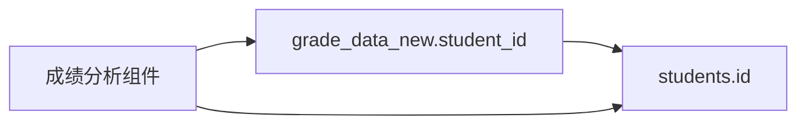
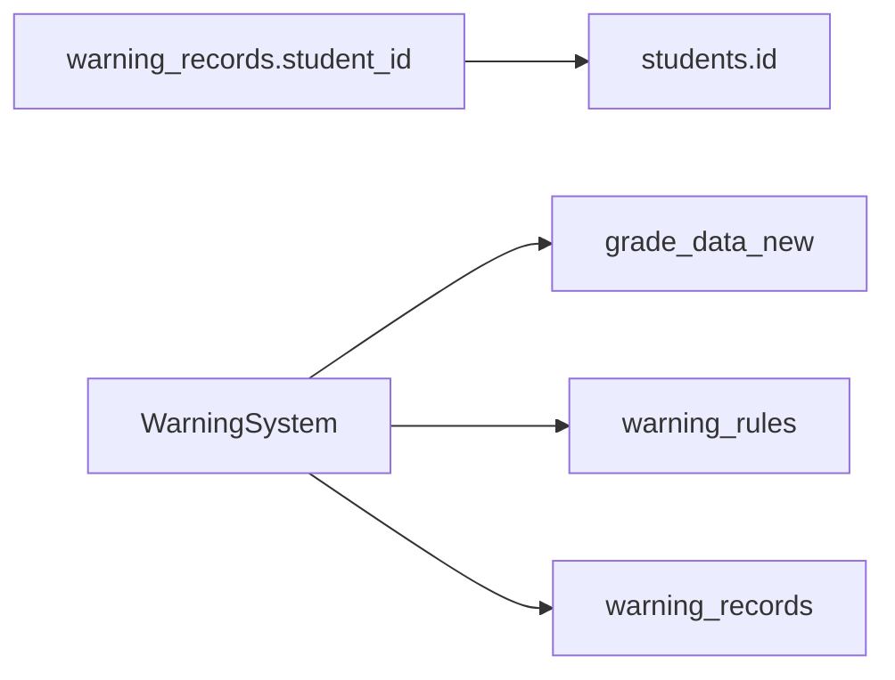

# 组件与数据表映射关系文档

## 概述

本文档详细描述了项目中各个组件与 Supabase 数据表之间的映射关系，帮助开发者快速了解数据流向和依赖关系。

## 总体架构图

```mermaid
graph TB
    subgraph "成绩管理模块"
        GradeAnalysis[ModernGradeAnalysisContext.tsx]
        GradeImporter[SimpleGradeImporter.tsx]
        GradeViewer[GradeViewer.tsx]
        GradeComparison[GradeComparisonChart.tsx]
        ExamService[examService.ts]
        GradeAPI[gradeDataAPI.ts]
    end

    subgraph "学生管理模块"
        StudentList[StudentList.tsx]
        StudentInfo[StudentInfo.tsx]
        StudentService[studentService.ts]
    end

    subgraph "作业管理模块"
        HomeworkList[HomeworkList.tsx]
        HomeworkSubmissions[HomeworkSubmissions.tsx]
        HomeworkService[homeworkService.ts]
    end

    subgraph "预警系统模块"
        WarningSystem[WarningSystem.tsx]
        WarningRules[WarningRules.tsx]
        WarningService[warningService.ts]
    end

    subgraph "班级管理模块"
        ClassInfo[ClassInfo.tsx]
        ClassService[classService.ts]
    end

    subgraph "数据表"
        GradeDataNew[(grade_data_new<br/>92条记录)]
        Students[(students<br/>10,654条记录)]
        HomeworkTable[(homework<br/>空表)]
        HomeworkSub[(homework_submissions<br/>156条记录)]
        Classes[(classes<br/>18条记录)]
        ClassInfoTable[(class_info<br/>空表)]
        Exams[(exams<br/>2条记录)]
        WarningRulesTable[(warning_rules<br/>5条记录)]
        WarningRecords[(warning_records<br/>6条记录)]
        KnowledgePoints[(knowledge_points<br/>6条记录)]
        Teachers[(teachers<br/>1条记录)]
        UserProfiles[(user_profiles<br/>4条记录)]
        UserRoles[(user_roles<br/>2条记录)]
        GradingScales[(grading_scales<br/>2条记录)]
    end

    %% 成绩模块映射
    GradeAnalysis --> GradeDataNew
    GradeImporter --> GradeDataNew
    GradeViewer --> GradeDataNew
    GradeComparison --> GradeDataNew
    ExamService --> GradeDataNew
    ExamService --> Exams
    GradeAPI --> GradeDataNew

    %% 学生管理映射
    StudentList --> Students
    StudentInfo --> Students
    StudentService --> Students

    %% 作业管理映射
    HomeworkList --> HomeworkTable
    HomeworkSubmissions --> HomeworkSub
    HomeworkService --> HomeworkTable
    HomeworkService --> HomeworkSub

    %% 预警系统映射
    WarningSystem --> WarningRulesTable
    WarningSystem --> WarningRecords
    WarningRules --> WarningRulesTable
    WarningService --> WarningRulesTable
    WarningService --> WarningRecords

    %% 班级管理映射
    ClassInfo --> Classes
    ClassInfo --> ClassInfoTable
    ClassService --> Classes
    ClassService --> ClassInfoTable

    %% 跨模块关联
    GradeAnalysis --> Students
    WarningSystem --> Students
    WarningSystem --> GradeDataNew
```



## 详细映射关系

### 1. 成绩管理模块

#### 核心数据表: `grade_data_new` (92条记录)

**主要组件:**
- `ModernGradeAnalysisContext.tsx` - 成绩分析上下文提供者
- `SimpleGradeImporter.tsx` - 成绩导入器
- `GradeViewer.tsx` - 成绩查看器
- `GradeComparisonChart.tsx` - 成绩对比图表

**服务层:**
- `examService.ts` - 考试服务 (主要查询 grade_data_new)
- `gradeDataAPI.ts` - 成绩数据API

**数据表结构:**
```sql
grade_data_new:
- student_id: 学生ID
- exam_id: 考试ID
- subject_*: 各科目成绩 (语文、数学、英语等)
- total_score: 总分
- class_rank: 班级排名
- grade_rank: 年级排名
```

### 2. 学生管理模块

#### 核心数据表: `students` (10,654条记录)

**主要组件:**
- `StudentList.tsx` - 学生列表
- `StudentInfo.tsx` - 学生详情

**服务层:**
- `studentService.ts` - 学生服务

**数据表结构:**
```sql
students:
- id: 学生ID (主键)
- name: 学生姓名
- class_id: 班级ID
- student_number: 学号
- other_info: 其他学生信息
```

### 3. 作业管理模块

#### 核心数据表: 
- `homework` (空表 - 需要数据)
- `homework_submissions` (156条记录)

**主要组件:**
- `HomeworkList.tsx` - 作业列表
- `HomeworkSubmissions.tsx` - 作业提交记录

**服务层:**
- `homeworkService.ts` - 作业服务

**数据表结构:**
```sql
homework_submissions:
- id: 提交ID
- student_id: 学生ID
- homework_id: 作业ID
- submission_time: 提交时间
- score: 成绩
```

### 4. 预警系统模块

#### 核心数据表:
- `warning_rules` (5条记录)
- `warning_records` (6条记录)

**主要组件:**
- `WarningSystem.tsx` - 预警系统主界面
- `WarningRules.tsx` - 预警规则管理

**服务层:**
- `warningService.ts` - 预警服务

**数据表结构:**
```sql
warning_rules:
- id: 规则ID
- rule_name: 规则名称
- conditions: 预警条件
- threshold: 阈值

warning_records:
- id: 记录ID
- student_id: 学生ID
- rule_id: 规则ID
- warning_time: 预警时间
```

### 5. 班级管理模块

#### 核心数据表:
- `classes` (18条记录)
- `class_info` (空表 - 需要数据)

**主要组件:**
- `ClassInfo.tsx` - 班级信息

**服务层:**
- `classService.ts` - 班级服务

**数据表结构:**
```sql
classes:
- id: 班级ID
- class_name: 班级名称
- grade_level: 年级
- teacher_id: 班主任ID
```

## 跨模块数据关联

### 成绩与学生关联


### 预警与成绩关联


## 数据表使用频率

| 数据表 | 记录数 | 使用频率 | 主要用途 |
|--------|--------|----------|----------|
| grade_data_new | 92 | 高 | 成绩查询、分析、排名 |
| students | 10,654 | 高 | 学生信息、关联查询 |
| homework_submissions | 156 | 中 | 作业提交记录 |
| classes | 18 | 中 | 班级管理、学生分组 |
| warning_rules | 5 | 低 | 预警规则配置 |
| warning_records | 6 | 低 | 预警历史记录 |
| exams | 2 | 低 | 考试基本信息 |
| homework | 0 | 无 | 需要补充数据 |
| class_info | 0 | 无 | 需要补充数据 |

## 优化建议

### 1. 数据完整性
- 补充 `homework` 表数据
- 补充 `class_info` 表数据
- 建立完整的外键关系

### 2. 查询优化
- 为 `grade_data_new.student_id` 建立索引
- 为 `students.class_id` 建立索引
- 为常用查询字段建立复合索引

### 3. 数据规范化
- 统一命名规范 (如 grade_data vs grade_data_new)
- 建立标准的数据字典
- 完善表间关联约束

## 注意事项

1. **关键修复**: 所有成绩相关查询现在正确使用 `grade_data_new` 表
2. **空表警告**: `homework` 和 `class_info` 表为空，相关功能可能不完整
3. **数据一致性**: 确保学生ID在各表间保持一致
4. **性能考虑**: 大表查询 (如 students) 需要适当的分页和索引

---

*最后更新: 2024年*
*文档版本: 1.0* 